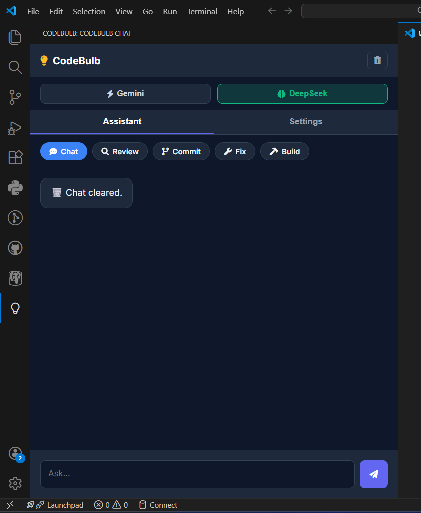
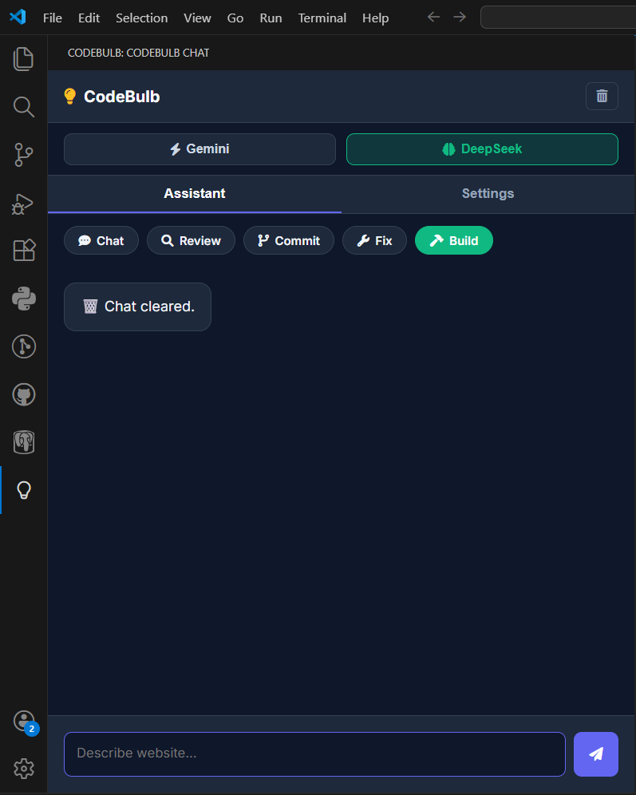

<div align="center">
  

  <h1>⚡ CodeBulb — AI Pilot for VS Code</h1>
  <h3>The <i>No-Nonsense</i> AI Coding Assistant</h3>

  <p>
    <b>Chat, refactor, fix bugs, and build websites — without leaving your editor.</b>
  </p>

  <p><b>Slogan:</b> <i>Bhai Code Karle</i> (Brother, let's code!)</p>

  <a href="https://marketplace.visualstudio.com/items?itemName=KaranPratapio.codebulb">
    
  </a>
  <a href="https://marketplace.visualstudio.com/items?itemName=KaranPratapio.codebulb">
    
  </a>
  <a href="LICENSE">
    
  </a>
</div>

---

## 🎥 Demo — See CodeBulb in Action

CodeBulb isn't just another chat bot.  
It **plans, builds, fixes, and explains code end-to-end**.

[](https://www.youtube.com/watch?v=phKzqYXWrOI)

---

## 🚀 Why CodeBulb?

CodeBulb is a **Dual-Engine AI coding assistant** built for developers who want **speed, control, and real productivity** — not fluff.

You can instantly switch between two powerful AI models depending on the task.

### 🔀 Dual-Model Architecture

| Feature | ⚡ Google Gemini 2.5 Flash | 🧠 DeepSeek V3 |
|------|--------------------------|--------------|
| Best For | Fast replies, explanations, free usage | Complex logic, architecture, deep reasoning |
| Cost | **Free** (Google AI Studio) | **Low cost** (via OpenRouter) |
| Speed | ⚡ Blazing fast | 🧠 Thoughtful & detailed |

---

## ✨ Key Features

### 💬 Smart Chat with Persistent Memory
- Ask questions, debug errors, refactor code
- **Chat history is saved automatically**
- Close VS Code and continue later from the same conversation
- **Smart code blocks** with one-click copy & insert
- Terminal-style command recall using `↑ / ↓`



---

### 🏗️ Project-Aware Website Builder
Describe your idea, for example:

> "Create a dark-theme portfolio website"

CodeBulb will:
1. Plan the project structure
2. Create folders & files (`index.html`, `style.css`, `script.js`)
3. Write complete, production-ready code automatically



---

### 🚑 Code Doctor & Auto-Fixer
- Scans your workspace
- Detects bugs, errors, and security risks
- **Fixes code automatically in place**

---

### 📝 Git Commit Companion
- Click **Commit** in the action bar
- CodeBulb analyzes `git diff`
- Generates clean, professional commit messages

---

## 🛠️ Installation

### Option 1: VS Code Marketplace (Recommended)
1. Open VS Code  
2. Press `Ctrl + P`  
3. Run:
```bash
   ext install KaranPratapio.codebulb
```
   Or search **CodeBulb** in Extensions

### Option 2: Install via VSIX
1. Download the latest `.vsix` from [GitHub Releases](https://github.com/KaraNxKP007/codebulb/releases)
2. VS Code → Extensions → **...** → **Install from VSIX**

### Option 3: Run from Source
```bash
git clone https://github.com/KaraNxKP007/codebulb.git
cd codebulb
npm install
```
Press **F5** to launch the Extension Development Host.

---

## 🔑 Setup & Privacy

🔐 **Your API keys never leave your machine.** CodeBulb stores keys securely using VS Code SecretStorage. No cloud storage. No tracking.

### Setup Steps
1. Click the 💡 **CodeBulb** icon in the Activity Bar
2. Open the **Welcome Screen**
3. Enter your API keys:
   - **Gemini API Key** (Free): [Get it here](https://aistudio.google.com/app/apikey)
   - **DeepSeek API Key** (OpenRouter): [Get it here](https://openrouter.ai/keys)
4. Click **Activate** 🚀

---

## ⚙️ Configuration

Customize CodeBulb in VS Code Settings:

- **Persona** Example: "Be concise", "Always use TypeScript", "Explain like I'm 5"
- **Model Switching** Instantly toggle between Gemini & DeepSeek using the colored header buttons.

---

## 🤝 Contributing

Contributions are welcome.

1. Fork the repository
2. Create your feature branch:
```bash
   git checkout -b feature/AmazingFeature
```
3. Commit your changes:
```bash
   git commit -m "Add AmazingFeature"
```
4. Push to GitHub
5. Open a Pull Request

---

## 📄 License

Distributed under the MIT License. See [LICENSE](LICENSE) for details.

---

<div align="center">
  <b>Made with ❤️ by Karan Pratap</b>
  <br><br>
  <i>Bhai Code Karle.</i>
</div>